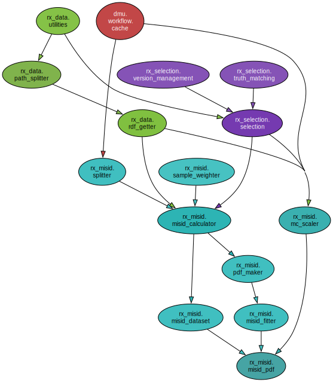

[TOC]

# $R_X$ misID

This project is meant to be used to extract the templates for the fully hadronic misID templates.

## Install

From, preferrably a micromamba/mamba virtual environment:

```bash
git clone ssh://git@gitlab.cern.ch:7999/rx_run3/rx_misid.git

pip install rx_misid
```

## Usage

The code will calculate the misID through Pass-Fail and control region fits 
The configuration is located in `rx_misid_data/misid.yaml`.

The code structure can be seen below:

<div style="text-align: center;">
  
</div>

### Pass-Fail approach

- Build the control regions with the weights (transfer function).
- Store them in a pandas dataframe
- Plot the data in different control regions.
- Provide a KDE PDF that will be used for fits.

### Fitting approach

- Pick up the data and provide it in control region
- Pick up noPID simulation and apply PID maps to put it in control region.
- Fit data and extract normalization factors
- Use PID maps for signal region to build misID model.

## Classes

### MisIDSplitter

This class is meant to split data into `Pass-Fail`, `Fail-Pass` and
`Fail-Fail` regions with the output filtered for:

- The hadron to be either a kaon or pion.
- The `B` meson to be a positive or negative

```python
from rx_misid.sample_splitter import SampleSplitter

spl   = SampleSplitter(
    rdf      = rdf,
    sample   = sample,
    hadron_id= 'kaon', # or pion
    is_bplus = True,   # or False
    cfg      = cfg)    # loaded misid.yaml
df    = spl.get_samples()
```

