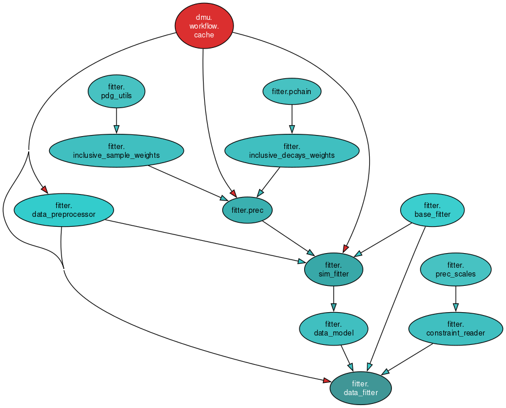

[TOC]

# Fitter

This project is meant to automate:

- Building of models
- Fits to MC 
- Fits to data
- Creation of validation plots, tables, etc
- Application of constraints
- Obtention of fitting information, specially:
    - Mass scales, resolutions
    - Signal yields for resonant and rare modes

And be used as an input for:

- Systematics evaluation
- Extraction of $R_K$ and $R_K^*$
- Calibrations

Ideally with minimal changes for new observables.
The class is organized as in the diagram below:



This project makes heavy use of caching through the [Cache](https://github.com/acampove/dmu?tab=readme-ov-file#caching-with-a-base-class)
class and thus:

- It allows for fast reruns
- It allows for the fitters to also be used to retrieve parameters

## Usage

For fits to data do:

```bash
fit_rx_reso -c rare/electron -q central -C 0.5 -P 0.5
```

to use the configuration in `src/fitter_data/rare/electron/data.yaml`
with an MVA working point of `0.5` for the combinatorial and part reco BDTs.

The script:

- Builds a likelihood for the data fit. Which requires fits to the simulation
  in order to pick up the components, which implies:
    - Apply the selection on the MC and data
    - Fit the MC
    - Use the MC to create components for the fit to the data
- Extracts constraints. Which in the case above constraint the misID yields
and the ratio of rare part reco background to signal.
- Minimizes the negative log-likelihood.

```python
from dmu.stats.zfit             import zfit
from dmu.generic                import utilities as gut
from dmu.stats.constraint_adder import ConstraintAdder

from fitter.data_fitter        import DataFitter
from fitter.likelihood_factory import LikelihoodFactory

fit_cfg = gut.load_conf(package='fitter_data', fpath='rare/electron/data.yaml')

# The observable should correspond to the branch name
# For resonant mode we have:
#
# - B_const_mass_M
# - B_const_mass_psi2S_M
#
# For the muon rare mode B_M is good enough
obs = zfit.Space('B_Mass_smr', limits=(4600, 7000))
ftr = LikelihoodFactory(
    obs    = obs,
    q2bin  = 'central',
    sample = 'DATA_24_*',
    trigger= 'Hlt2RD_BuToKpEE_MVA',
    project= 'rx',
    cfg    = fit_cfg)
nll = ftr.run()
cfg = ftr.get_config()

cfg_cns = _get_constraints()

cad = ConstraintAdder(nll=nll, cns=cfg_cns)
nll = cad.get_nll()

ftr = DataFitter(
    name = 'data_fit',
    d_nll= {'' : (nll, cfg)},  # If doing simultaneous fits, this dictionary
    cfg  = fit_cfg)            # will hold each signal region
obj = ftr.run(kind='conf')
```

where `obj` is a `DictConf` (from the `omegaconf` project) dictionary where the
parameters and errors can be accessed as:

```python
val = obj['name']['value']
err = obj['name']['error']
```

### Constraints

The constraints are given by a configuration like the one below:

```yaml
signal_shape:
  kind        : GaussianConstraint 
  parameters  :
    - mu
    - sg
  observation : 
    - 5200
    - 50
  cov: 
    - [100, 10]
    - [ 10,  4]
yields:
  kind        : PoissonConstraint
  parameters  :
    - nsig 
    - nbkg 
  observation : 
    - 1000 
    - 1000 
```

where the are multiple sections, each of them specifying the kind of constraint, the
parameters to which these constraints are applied and the values of the parameters.

The constraints can be written to a YAML file or written in a python dictionary.
These then need to be made into a `DictConfig` with:

```python
from omegaconf import OmegaConf

cfg = OmegaConf.create(config)
```

before passing it to the `ConstraintAdder`, which will attach the constraints
to the likelihood.

### Summarize fits

To collect the fit parameters do:

```python
from fitter import FitSummary

smr = FitSummary(name='mid_window')
df  = smr.get_df()
```

which will:

- Look for all the `mid_window` fits and collect the parameters from
the JSON files.
- Use them to build a pandas dataframe and return it.

### Access parameters

The result of this will be a large table, this table can be accessed with:

```python
from fitter    import ParameterReader
from rx_common import Project
from rx_common import Trigger 
from rx_common import Qsq 

rdr = ParameterReader(name = 'mid_window')
ms  = rdr(
    brem     = 1, 
    block    = 3, 
    trigger  = Trigger.rk_ee_os, 
    project  = Project.rk,
    q2bin    = Qsq.jpsi)
```

where `ms` is a `Measurement` object that can be read with:

```python
# Retrieve yield for resonant fit component
value, error = ms['yld_jpsi']

# Print contents
print(ms)
```

## Toys

### Making them

In order to run toys do:

```bash
fit_rx_data -c rare/electron -q central -C 0.98 -P 0.60 -t toys/maker.yaml -N 30
```

this will:

- Run the fit to the actual data using:

```bash
src/fitter_data/rare/electron/data.yaml
```

as the configuration. This file includes paths to configurations needed by the
fits to the simulation, needed to get the components of the fit.

- Run fits for the `central` $q^2$ bin at the $(0.98, 0.60)$ working point.
- Once the fit to the real data is finished, it will run `30` toy fits
following the configuration in:

```bash
src/fitter_data/toys/maker.yaml
```

which will decide how to do the minimization itself. 
The toys output will be saved as a pandas dataframe in a `parquet` file

### Plotting them

In order to plot the toys run:

```bash
plot_toys -v v3 -n 10
```

This will:

- Run over the version `v3` of the toys
- Use processes to run in parallel

The outputs will go next to the `toys.parquet` file in the `plots` directory

A summary of the toy fits will be saved in the `summary.yaml` file within the
`v3` directory, plots can be made from it by running:

```bash
summarize_toys -v v3
```

